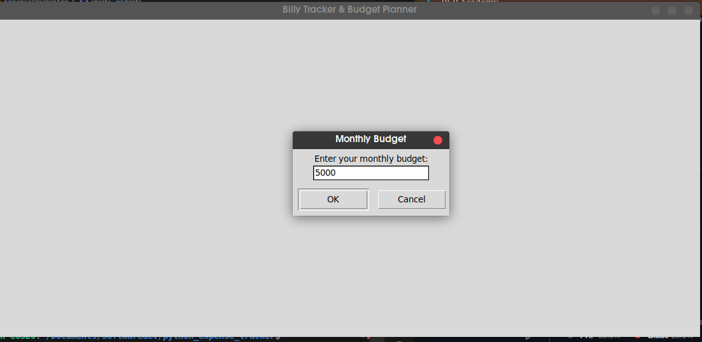
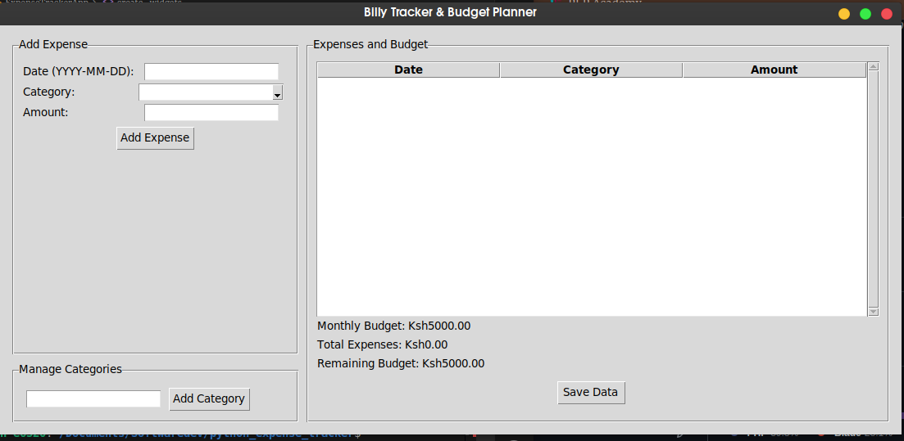
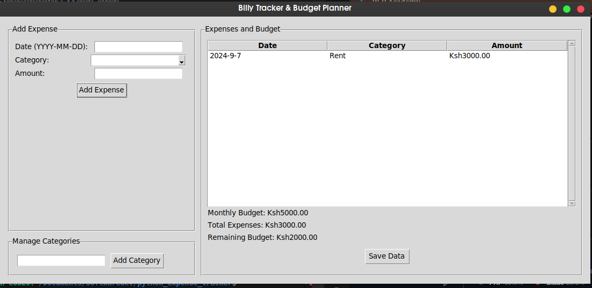

# Billy tracker & Budget planer app

In a bustling city where every penny counted, a young software developer named waren found himself overwhelmed by his finances. With bills piling up and expenses spiraling out of control, he realized he needed a solution to manage his money better. Inspired by his own struggles, waren decided to create an app that would help not just him, but anyone looking to take control of their finances.

 ## screenshots
 
 
 

## Thus, Billy Tracker & Expense was born.

- ## The Concept
Billy Tracker was designed to be user-friendly and intuitive. Alex envisioned an app that would allow users to easily input their expenses, categorize them, and visualize their spending habits. He wanted to empower people to stick to their budgets and make informed financial decisions.

- ## Development Journey
Using Python and the Tkinter library, Waren began coding late into the night. He crafted a sleek interface where users could enter their expenses with just a few clicks. The app featured:

- *Expense Input*: Users could log their expenses by date, category, and amount.
- *Budget Management*: Billy Tracker prompted users to set a monthly budget, helping them stay on track.
- *Category Customization*: Users could add their own categories, making the app flexible for different lifestyles.
- *Visual Reports*: The app generated reports that displayed total expenses and remaining budget, giving users a clear picture of their financial health.

`Billy Tracker & Expense` will transform from a personal project into a community tool that wil  empower individuals to take charge of their finances. waren's vision of creating a simple yet powerful expense tracker had come to life, proving that with the right tools, anyone could achieve financial freedom.
